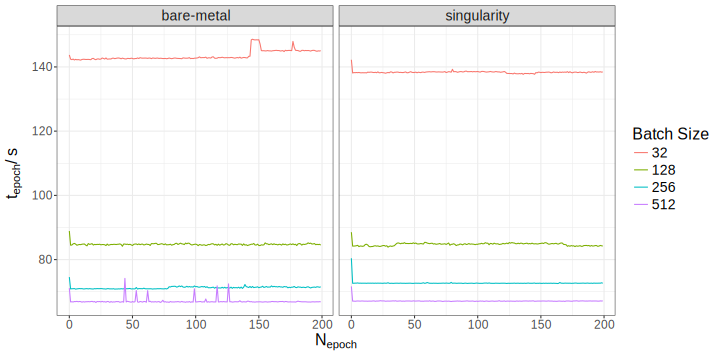
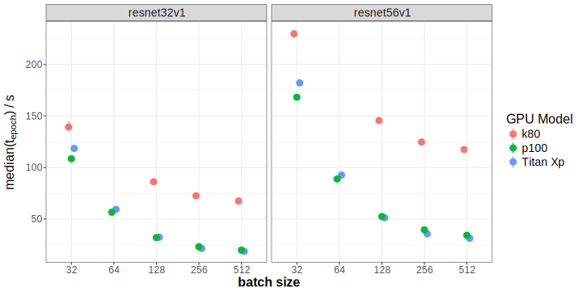
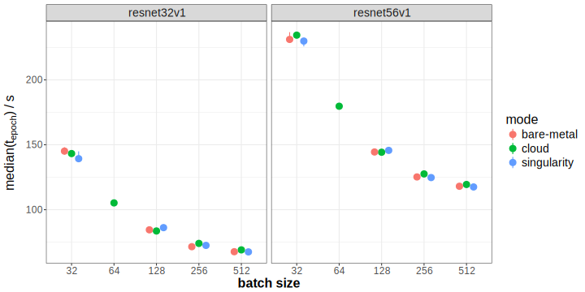

# Agenda {-}

## For the next 10 Minutes ... {#agenda style="font-size: 1.5em"}

1. MPI CBG
2. Benchmarks in Deep Learning
3. Results
4. Breathe again!

# MPI CBG

## Scientific Software Engineer

.container-fluid[

.row align-items-center[

.col[

{ class="figure-img img-fluid" height="50%" }  

[Services at Max Planck Institute of Molecular Cell Biology and Genetics](https://www.mpi-cbg.de) (MPI CBG), 500 staff

.]

.col[

{ class="figure-img img-fluid" height="50%" }  

[Center for Systems Biology](http://www.csbdresden.de/), (CSBD) 150 staff

.]

.]

.]

:notes[

- my role
- employer = Scionics

:]

## Deep Learning Bootcamp {#bc style="font-size: 1.5em"}

[indico.mpi-cbg.de/e/deeplearning2018](https://indico.mpi-cbg.de/e/deeplearning2018)

- registration opens soon
- in cooperation with [MPI CBG](https://www.mpi-cbg.de), [CSBD](https://www.csbdresden.de), [HZDR](https://www.hzdr.de), [Zalando](https://research.zalando.com/) and [Uniklinikum](https://www.uniklinikum-dresden.de/de)
- one week of introduction to deep learning basics

# Deep Learning Benchmarks

## Status Quo

- benchmarking in deep learning in a tricky spot
- [dawnbench](https://dawn.cs.stanford.edu/benchmark/)
- [mlperf](https://mlperf.org/)
- blogs
- tweets
- papers

:notes[

- tricky spot = money
- weaknesses are NEXT!

:]

## Observations

- [dawnbench](https://dawn.cs.stanford.edu/benchmark/):
    + more a competition from **1 single run**
    + model implementation not fixed
    + hardware coverage not uniform
    
- [mlperf](https://mlperf.org/)
    + just announced
    + aspiring to be a SPEC for DL
    + **mean of 5 runs**
    
- rest: Mostly not reproducible or just single runs!

# [Deeprace](https://github.com/psteinb/deeprace)

## Bare-metal versus [singularity container](https://singularity.lbl.gov)

.container-fluid[

.row align-items-center[

.col-8[

{ class="img-fluid" style="width: 100%;" }  

.]

.col-4[

- training on taurus K80 nodes

- CIFAR10 data (1.1 GB, 70k images)

- keras 2.1.4 with tensorflow 1.3

.]

.]

.]

[Thanks for the CPU/GPU time, ZiH!]{.class class="fragment highlight-blue"}

## Hardware comparison

{ class="img-fluid" style="width: 80%;" }  

[Thanks for the CPU/GPU time, ZiH!]{.class class="fragment highlight-blue"}

:notes[

- price difference (gaming cards vs tesla)
- generation age (2x difference)

:]

## Framework comparison

{ class="img-fluid" style="width: 70%;"}  

[Thanks for the CPU/GPU time, MPI CBG!]{.class class="fragment highlight-blue"}

:notes[

- single GPU varies minimally
- framework difference small
- no clear conclusion from just 2 models

:]

## Cloud vs Bare-metal

{ class="img-fluid" style="width: 80%;" }  

[Thanks to Scionics for the cloud credits!]{.class class="fragment highlight-blue"}

:notes[

- cloud appears on par for resnet models

:]

# Summary

## So far ... {#sofar style="font-size: 1.5em"}

- benchmarks have been very useful learning tool

- for resnet models, benchmarks ...

    + make decision for hardware easier
    + makes framework options clearer
    + resnet30/50 on K80 GPUs: cloud == HPC
    

## There is more to come ... {#more style="font-size: 1.5em"}

- bare-metal-versus-cloud not answered (disk space, network performce, ...)

- stay tuned on [github.com/psteinb/deeprace](github.com/psteinb/deeprace)

- looking for sponsors and/or contributors (distributed training, inference benchmarks)
