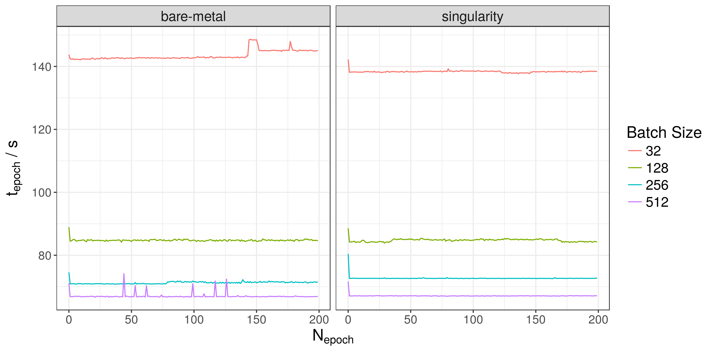
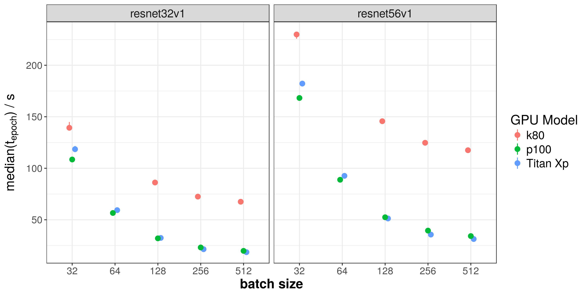

# Agenda {-}

## For the next 10 Minutes ... {#agenda style="font-size: 1.5em"}

1. Peter who?
2. MPI CBG
3. Benchmarks in Deep Learning
4. Results
5. Breathe again!

# About me

## Scientific Software Engineer

.container-fluid[

.row align-items-center[

.col[

{ class="figure-img img-fluid" height="50%" }  

[Services at Max Planck Institute of Molecular Cell Biology and Genetics](https://www.mpi-cbg.de) (MPI CBG), 500 staff

.]

.col[

{ class="figure-img img-fluid" height="50%" }  

[Center for Systems Biology](http://www.csbdresden.de/), (CSBD) 150 staff

.]

.]

.]

:notes[

- my role
- employer = Scionics

:]

# Deep Learning Benchmarks

## Status Quo

- benchmarking in deep learning in a tricky spot
- [dawnbench](https://dawn.cs.stanford.edu/benchmark/)
- [mlperf](https://mlperf.org/)
- blogs
- tweets
- papers

:notes[

- tricky spot = money
- weaknesses are NEXT!

:]

## Observations

- [dawnbench](https://dawn.cs.stanford.edu/benchmark/):
    + more a competition from single run
    + model implementation not fixed
    + hardware coverage not uniform
    
- [mlperf](https://mlperf.org/)
    + just announced
    + aspiring to be a SPEC for DL
    + mean of 5 runs :/
    
- rest: Mostly not reproducible or just single runs!

# [Deeprace](https://github.com/psteinb/deeprace)

## Bare-metal versus container

.container-fluid[

.row align-items-center[

.col[

{ class="img-fluid" style="width: 90%;" }  

.]

.col[

- taining on taurus K80 nodes   
([Thank you, ZiH!]{.class class="fragment highlight-red"})

- CIFAR10 data (1.1 GB, 70k images)

- keras 2.1.4 with tensorflow 1.3

.]

.]

.]

## Hardware comparison

{ class="img-fluid" style="width: 90%;" }  

:notes[

- price difference (gaming cards vs tesla)
- generation age (2x difference)

:]

## Framework comparison

## Cloud vs Bare-metal

# Summary

## So far ...

- benchmarks have been very useful learning tool

- for resnet type models and alike:

    + make decision for hardware easier
    + makes framework decision clearer
    + resnet30/50 on K80 GPUs: cloud == HPC
    

## There is more to come ...

- bare-metal versus cloud not generally answered (disk space, network performce, ...)

- stay tuned on [github.com/psteinb/deeprace](github.com/psteinb/deeprace)

- looking for sponsors and/or contributors (distributed training, inference benchmarks)
